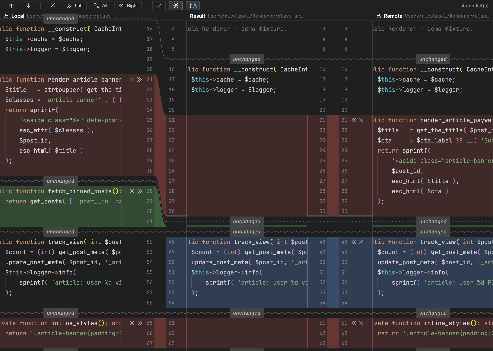
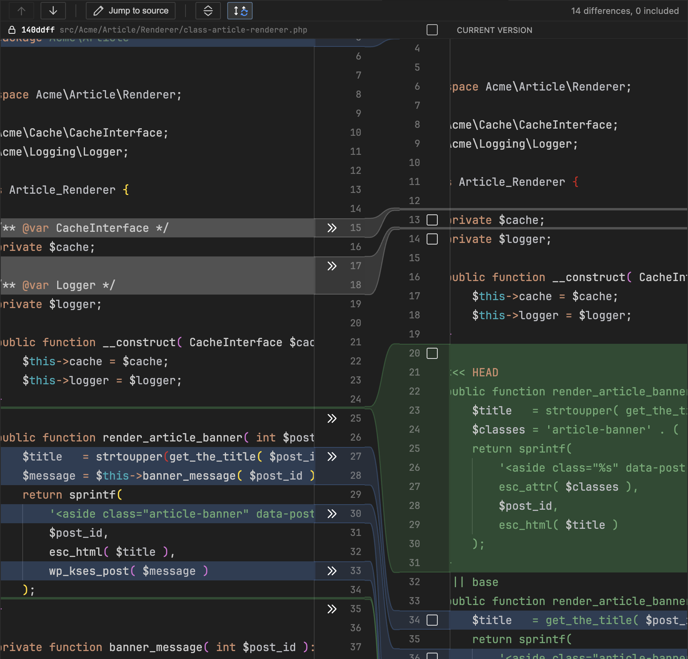
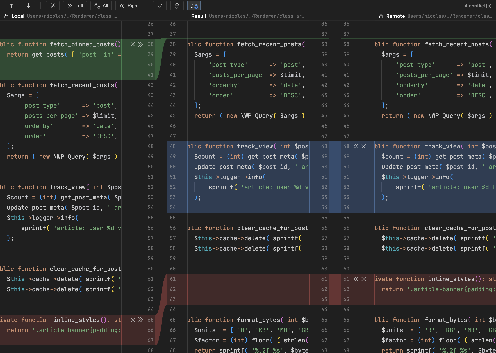

# Resolve

The IntelliJ merge & diff tools, ported to VSCode.

Resolve is a side project. Bugs and missing pieces are likely — open an
issue if you spot something.

## What's inside

### Merge editor



Three panes (Local / Result / Remote) connected by bezier ribbons,
the same way IntelliJ shows them. Opens automatically on any
conflicted file.

### Diff viewer



A two-pane diff between `HEAD` and the working tree, with per-hunk
staging. Opens when you click a modified file from the Source Control
panel.

### Collapsed unchanged ranges



Long stretches of unchanged code fold into a single placeholder row,
crossed by a wave traversing all panes. Click a chip to expand it
back.

## Install

```bash
git clone https://github.com/cssrno/resolve.git
cd resolve
npm install
npm run build
npm run package
code --install-extension resolve-*.vsix
```

## Settings

| Setting | Default | What it does |
|---|---|---|
| `conflict.diffViewer.mode` | `side-by-side` | `side-by-side` uses Resolve's diff viewer for SCM clicks; `native` keeps VSCode's built-in. |

## License

MIT — see [LICENSE](LICENSE).
